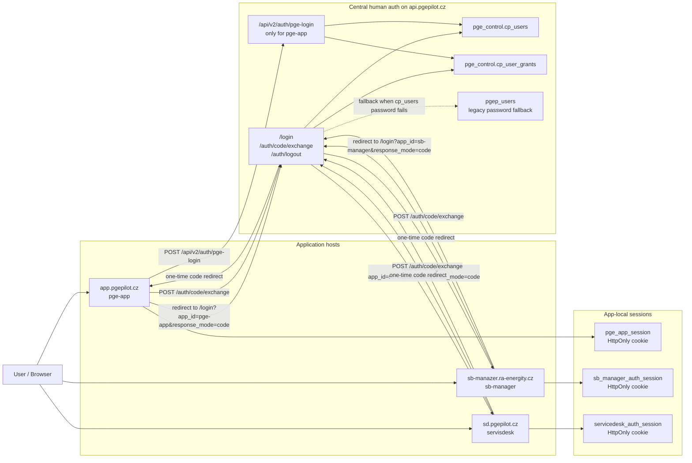
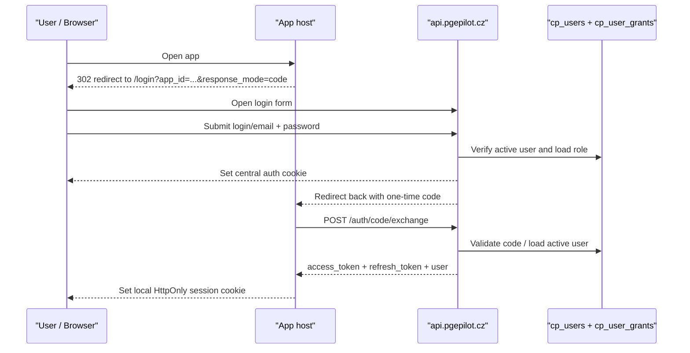
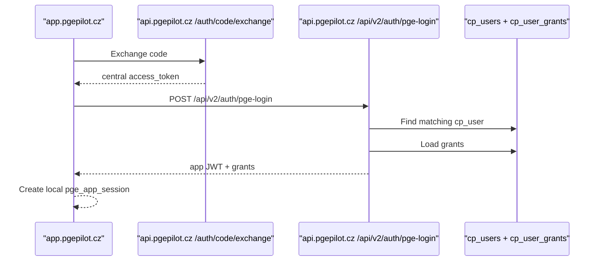
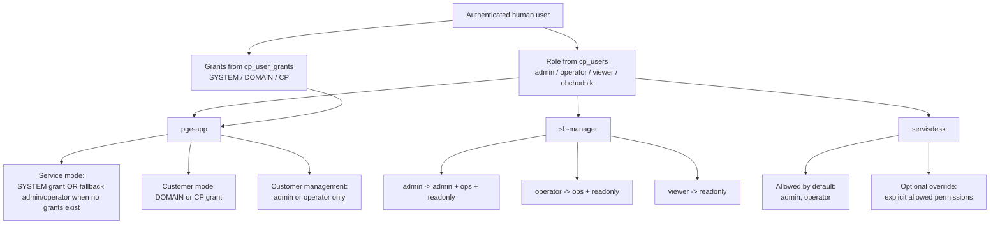

# 22 -- Applications And Auth Logic Diagram

> Live graphical schema for human-user login across PgePilot services.
> Verified against code and live runtime on 2026-04-22.

---

## Scope

This document describes **human-user auth** for:

- `pge-app`
- `sb-manager`
- `servisdesk`

It does **not** describe SmartBox machine auth, provisioning tokens, or local SB login.

---

## 1. Current Live Topology

### Interpretation

- all three human-facing apps now start login on `api.pgepilot.cz`
- all three use `response_mode=code`
- browser receives **local app cookies**, not reusable access tokens in URL
- `pge-app` is the only app with an extra bridge step, because it still needs its own app JWT and grant payload

---

## 2. Generic Login Flow

### `pge-app` extra step

Meaning:

- `sb-manager` and `servisdesk` directly consume the central auth identity
- `pge-app` still converts that central identity into its own app token and grant model

---

## 3. Authorization Logic

### Practical rules

- `pge-app`
  - service/admin part is controlled by `role` and `SYSTEM` grant
  - customer part is controlled by `DOMAIN` / `CP` grants
- `sb-manager`
  - maps central role/permissions into local groups:
    - `pge_sbmanager_admin`
    - `pge_sbmanager_ops`
    - `pge_sbmanager_readonly`
- `servisdesk`
  - allows `admin` and `operator` by default
  - can also be extended by explicit permissions

---

## 4. Example: `holbytlo`

Current verified live identity:

- login: `holbytlo`
- role: `admin`
- grant: `SYSTEM`

Result:

- `pge-app` service/admin section: **yes**
- `sb-manager`: **yes**, full admin path
- `servisdesk`: **yes**
- `pge-app` customer-only section: **not by grant alone**, unless extra `DOMAIN` or `CP` grants are added

---

## 5. Important Caveat

Current central auth still contains a **legacy password fallback**:

- first try `pge_control.cp_users`
- if password check fails, try legacy `pgep_users`
- if legacy login matches and there is a mapped `cp_users` record, continue as mapped PgePilot user

That means the current live state is safer than the old token-in-URL flow, but not yet the clean final target from `19-pgepilot-auth-migration-plan.md`.
